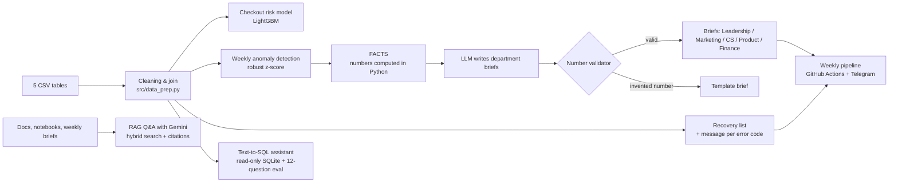

# Online Movie Ticketing (2019–2022): From Booking Analysis to a Payment-Failure Recovery System

In this case study I take the role of a data analyst at an online movie-ticketing platform. The project started as an exploratory analysis of booking behaviour. Re-checking that analysis showed a problem it had missed: **one in seven new customers fails at their very first payment, and most of them never buy a ticket.**
The project now covers the full loop: **find the problem → measure it → build a solution → check whether it would have worked**. The solution combines machine learning, anomaly detection, automation and an LLM.

> Dataset: 5 linked tables from an online ticketing system, 2019–2022: 154,725 payment attempts from 119,477 customers. Prices are kept in the dataset's original units.

---

**Docs:** [Department guide](docs/huong_dan_phong_ban.md) · [Operations runbook](docs/runbook.md) · [Data workflow & metric definitions](docs/data_workflow.md) · [How AI was used](docs/ai_usage_log.md) · [Changelog](CHANGELOG.md) *(docs in Vietnamese, for the operating team)*

## 1. The business problem

| | |
|---|---|
| **16,802 customers (14.1%)** | failed payment on their **first** attempt |
| **13,701 of them (81.5%)** | **never bought a ticket**, before or after |
| **~1,000** | retried successfully within 24 h; across all failed payments only **7.1%** were recovered within 7 days |
| **74%** of these lost customers | hit **bank-side (external)** errors they cannot fix themselves |
| Failure rate by payment method | in-app wallet **2.6%** · bank account 20.1% · credit card 22.3% · debit card **27.3%** |

This affects several teams at once. **Marketing** pays to acquire customers who are then lost at checkout. **Customer Care** gets no list of customers to call back. **Product/IT** sees bank errors as "not our bug". **Finance** loses revenue at the very last step.

## 2. What I built



| Component | What it does | Result (backtested on historical data) |
|---|---|---|
| **Checkout risk model** (`notebooks/03`) | Scores the failure risk of each payment attempt, using only information available at that moment (no leakage) | Trained on 2019–2021, tested on 2022: AUC **0.77**; the riskiest 20% of attempts contain **43%** of failures. **A one-variable rule (payment method) already reaches AUC 0.75**, so the biggest lever is steering customers to safer payment methods, which needs an A/B test before rollout. |
| **Weekly anomaly alerts** (`notebooks/04`) | Compares each error group's weekly failure rate with the median of the previous 8 weeks | Flagged the 2022 bank-error spike in the week of **28 Feb 2022** (17.8% vs 8.7% baseline, z = 5.0), about **3–4 weeks before** a monthly report would show it. Of the 6 alerts raised in 2022, 3 belong to that incident and 3 were minor or noise. |
| **Recovery list** | Every week, lists the customers whose payment failed and who have not bought since, each with a pre-approved message for their error code | 175 customers for the week of 28 Feb 2022 |
| **LLM department briefs** | Python computes every number; the LLM only writes the text; a validator rejects any brief containing a number not in FACTS | A test brief with invented numbers is caught (`25,000`, `9.1%`). The pipeline still works without an API key by falling back to templates. |
| **Ask-the-docs (RAG, Gemini)** (`src/rag.py`) | Questions in Vietnamese over 144 chunks of runbook, metric definitions, notebook findings and weekly briefs. Hybrid retrieval (Gemini embeddings + TF-IDF, rank fusion); Gemini answers only from the retrieved chunks with `[n]` citations; any number not present in those chunks blocks the answer. Works as keyword search without an API key. | On a small 14-question set written from the docs (`eval/rag_eval.json`): right document in the top 6 for 12/12, correct answers 14/14 including 2 out-of-scope questions correctly refused. A basic check, not an independent benchmark. |
| **Ask-your-data (Text-to-SQL, Gemini)** | Questions in Vietnamese → Gemini writes one `SELECT` statement → read-only SQLite. Destructive SQL is blocked. | Evaluation set of 12 questions with gold-standard SQL (`eval/ask_data_eval.json`), graded by comparing result sets: **12/12 correct** (run on 2026-10-09; answered by several Gemini models through the fallback chain because the primary model had hit its daily free quota). |

### What each department gets (`notebooks/05`, one tab per department in the app)
| Department | Before | With the system | Reliability |
|---|---|---|---|
| **Leadership** | Many disconnected reports | Weekly summary brief + a dashboard of the **6 KPI groups** from the original report's measurement plan (14 metrics, month over month) | High: computed directly from data; metrics that need a future window show `n/a` until it is complete |
| **Marketing** | Blanket vouchers | The report's 4 customer segments (high-value, new one-time, lapsed, promo-sensitive), each with its action, **+ a 90-day repurchase score** (backtest AUC **0.66** vs 0.61 for a recency rule; top 20% repurchase at **1.8×** the average) **+ which campaigns only attract one-time buyers** | Segments and campaigns: high. Score: moderate, use it to prioritise, not to predict |
| **Customer Care** | Learns about errors only after asking IT | Early alert, weekly recovery list, pre-approved message for each of the **7 error codes** | High |
| **Product / IT** | Waits for complaints | Weekly alert plus **error code × platform × payment method** vs the 8-week baseline. In the week of 28 Feb 2022 it pinpointed *Payment failed from bank* on mobile + bank account: **4.6% → 21.1%** | High: some noise on rare error groups |
| **Finance** | No idea what failed payments cost | Value of failed orders **not recovered within 7 days**, plus **discounts spent on customers who never returned within 90 days**. Jan–Sep 2022: **93%** of failed-order value was never recovered and **90%** of discount spend went to customers who did not return | High for what is measured; a lower bound (no ad spend or lifetime value in the data) |

Campaign finding: **reward point** campaigns kept almost no one (**95.7%** one-time buyers, ~127 discount units per returning customer), while **vouchers** cost ~12 per returning customer. Customers who used no promotion returned slightly *more* often than those acquired through direct discounts.

### Operational automation (`notebooks/06`)
| | What it does | Result |
|---|---|---|
| **Daily data ingestion** (`src/ingest.py`) | Simulates the source system dropping one file per day (1,174 daily files). Loads **only new files** into a parquet warehouse, tracking state, and archives loaded files. Also accepts **reference updates** (`customer_`, `campaign_`, `device_detail_`, `status_detail_<date>.csv`), applied *before* the same day's transactions so new customers and new campaigns pass. Multi-day exports are split by day automatically, and a re-sent file with different content is blocked | All 1,174 files loaded in ~77 s; the warehouse matches the original CSV exactly (154,725 rows). Tested with new customers (blocked without a customer file, passes with one), a new campaign, a new error code with an invalid error group (blocked until fixed), a 2-day export, and a re-sent file |
| **Data-quality gate** (`src/quality.py`) | 12 checks per file: schema, types, key nulls, duplicates, already-loaded IDs, unknown status/customer/campaign codes, price rules, date of file, daily volume. An **error stops the pipeline and quarantines the file**, so no report is built on bad data | Real 2019–2022 data: 0 errors. An injected bad file was caught on all 4 planted problems and quarantined. Volume threshold tuned to warn on ~5% of days instead of ~11% |
| **Weekly Excel report** (`src/excel_report.py`) | 7 sheets: summary with links, one sheet per department, data quality. Native Excel charts, alert cells highlighted, KPI cells green/red by each metric's good direction, filters on lists | Generated every pipeline run, also downloadable from the app |
| **Analyst-ready datasets** (`src/marts.py`) | `fact_payment_attempts`, `dim_customer`, `customer_features` (RFM + segment + repurchase score), `campaign_summary`, as parquet + CSV, with an **auto-generated data dictionary** (type, description, null rate, unique count, examples). Primary keys are checked before writing | 154,725 / 131,400 / 105,776 / 211 rows |

### What I tried that did **not** work (kept on purpose)
- **Predicting repeat purchase from the first booking alone**: AUC **0.53**, no better than chance. Booking details (channel, promotion, time, price) do not tell you who will come back. Purchase *history* (recency, frequency, spend) does carry a signal, which is the score Marketing uses (AUC 0.66).
- **Predicting which failed payments recover on their own**: AUC **0.52**. Since only ~7% recover, there is no point targeting a subset: **contact everyone** who failed. That is why the recovery list covers all of them.

## 3. Key findings from the booking analysis (`notebooks/01`)
- **89%** of payments come through the mobile app. Weekends (Sat–Sun) average **~1.8×** the daily volume of Mon–Thu.
- **~65%** of buying customers have used a promotion, and **~89%** of those used one only once. Month-1 cohort retention is **4.3% (2019)** and **3.7% (2022)**, even though 2022 ran more promotions.
- About 11% of accounts are "Not verify", almost all with an auto-filled 1970 birth date, so they are excluded from the age analysis.

### Corrections to the first version of this analysis
| First version | Corrected |
|---|---|
| The "2022" cohort was filtered with `time < 2020-01-01`, so it actually re-plotted 2019 | Filters 2022 correctly |
| The customer-value table only included customers with at least one successful payment, so **the 13,701 customers who never bought were invisible** | Built from all payment attempts |
| 6 error codes analysed | The data has **7** ("Payment overdue" was missing) |
| Age computed with `date.today()`, so results changed on every run | Age computed as of 2022-12-31 |
| "75% of customers aged 26–35", "55% use iOS", "weekends 1.5× weekdays" | Could not be reproduced: **54%**; iOS = **37%** of mobile payments (47.5% of mobile devices are unidentified); weekends **~1.8×** |

## 4. Repository structure
```
├── data/                     # 5 raw CSV tables
├── file analyst.ipynb        # original exploratory notebook (kept for reference)
├── notebooks/
│   ├── 01_data_preparation_and_eda.ipynb
│   ├── 02_problem_discovery.ipynb
│   ├── 03_payment_failure_model.ipynb
│   ├── 04_monitoring_automation_llm.ipynb
│   ├── 05_department_deliverables.ipynb
│   └── 06_automation_data_ops.ipynb
├── src/                      # shared code used by notebooks, pipeline and app
│   ├── data_prep.py  metrics.py  anomaly.py  model.py
│   ├── kpis.py  marketing.py  product.py  finance.py  departments.py
│   ├── ingest.py  quality.py  excel_report.py  marts.py
│   ├── llm.py  briefs.py  ask_data.py  notify.py  deliver.py
│   └── pipeline.py           # weekly job
├── app/streamlit_app.py      # one tab per department + data quality & dictionary + ask-your-data
├── docs/                     # runbook, data workflow & metrics, department guide, AI usage log
├── tests/                    # 41 pytest tests (quality gate, ingestion scenarios, alerts, briefs, SQL guard, Excel, email)
├── eval/ask_data_eval.json   # 12 questions + gold SQL
├── models/                   # trained LightGBM model
├── reports/weekly/<week>/    # Excel report + 5 briefs + CSV per department + summary.json
├── data/marts/data_dictionary.md   # (marts themselves are regenerated with `python -m src.marts`)
├── 1_CHAY_BAO_CAO_TUAN.bat  2_MO_DASHBOARD.bat  3_DAT_LICH_TU_CHAY_THU_HAI.bat   # double-click launchers
├── scripts/chay_tu_dong.bat  # unattended run used by the launchers and Task Scheduler
├── config/recipients.example.json
├── CHANGELOG.md
└── .github/workflows/weekly_pipeline.yml
```
Generated folders (`data/incoming`, `data/warehouse`, `data/quarantine`, `data/marts/*.parquet|csv`, `reports/data_quality`, `reports/daily`) are git-ignored and rebuilt by the commands below.

## 5. How departments use it (no code)
| Who | How |
|---|---|
| **Each department** | Every Monday they get an **email** with their brief in the body and **their own Excel file** attached (summary + their sheet; leadership gets the full workbook). Subject is prefixed with ⚠ when there is an alert. |
| **Anyone who wants more detail** | Open the **dashboard link** (Streamlit Community Cloud), with one tab per department and download buttons. |
| **The report operator** | Double-click `1_CHAY_BAO_CAO_TUAN.bat` (ingest → quality gate → report → email, then opens `reports/BAO_CAO_MOI_NHAT.xlsx`), `2_MO_DASHBOARD.bat` (local dashboard), or `3_DAT_LICH_TU_CHAY_THU_HAI.bat` (Windows Task Scheduler runs it every Monday 08:00). If the data fails the quality gate, the window says so and opens the quarantine folder. |

Email setup: copy `config/recipients.example.json` to `config/recipients.json`, then set `SMTP_*` in `.env` (or the matching GitHub Secrets plus `RECIPIENTS_JSON`). Until SMTP is configured **nothing is sent**: emails are saved as `.eml` previews in `reports/weekly/<week>/outbox/`.

## 6. How to run
```bash
pip install -r requirements.txt          # requirements-dev.txt adds pytest
python -m pytest -q                      # 55 tests, no API calls
python scripts/check_secrets.py          # must print OK before any push (no keys in tracked files)

# daily ingestion with data-quality checks
python -m src.ingest simulate                  # once: split history into one file per day
python -m src.ingest run                       # load new files only; exit code 1 if a file fails
# new data: drop ticket_history_YYYY-MM-DD.csv (+ customer_/campaign_/device_detail_/status_detail_YYYY-MM-DD.csv
# when there are new customers, campaigns, devices or error codes) into data/incoming/, then run again
python -m src.ingest inject-bad                # create a broken file to see the gate stop the run

# weekly pipeline (no API key needed: falls back to template briefs)
python -m src.pipeline --week 2022-02-28 --no-llm
python -m src.pipeline --ingest --no-llm       # ingest first, then report; bad data stops the run
python -m src.pipeline --ingest --send-email   # ... and email each department (or save .eml previews)

# analyst-ready datasets + data dictionary
python -m src.marts

# LLM briefs: copy .env.example to .env and set ANTHROPIC_API_KEY
# Ask-the-docs (RAG) and Ask-your-data (Text-to-SQL) use Gemini: set GEMINI_API_KEY
python -m src.pipeline --week 2022-02-28

# RAG over docs & briefs: set GEMINI_API_KEY in .env
python -m src.rag ask "Khi pipeline dừng vì dữ liệu lỗi thì làm gì?"
python -m src.rag eval

# dashboard
streamlit run app/streamlit_app.py
```

## 7. Limitations
- All results are **backtests on historical data**, not results from a live deployment.
- The payment-method effect is a **correlation**. Customers who use the in-app wallet may differ from card users, so an A/B test is needed before claiming that switching methods reduces failures.
- The model is well-ranked but over-predicts in the high-risk groups, because 2022 had a lower failure rate than 2019–2021. Recalibrate it before using the probabilities directly.
- The dataset has no complaint text, campaign costs or customer-contact data, so the value of recovering customers is estimated only from first-order value (a lower bound).

**Tools:** Python (pandas, scikit-learn, LightGBM, openpyxl), Excel, SQLite, Parquet, Streamlit, Plotly, Claude API (structured outputs), Gemini API (embeddings, RAG, Text-to-SQL), GitHub Actions
