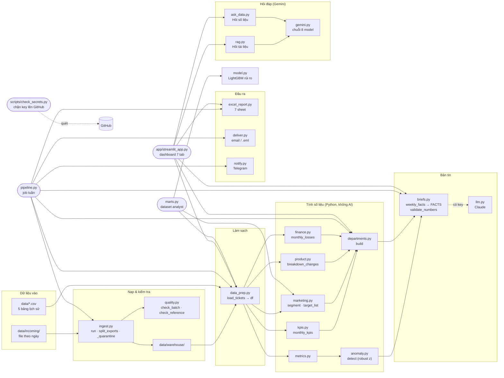

# Bản đồ kiến trúc - muốn sửa gì thì mở file nào

Lập từ đồ thị code (codebase-memory, project `movie-ticket`, 956 nút / 2,525 cạnh) ngày 2026-10-09, v1.8.1.
Ghi **tên hàm/hằng số** thay vì số dòng (số dòng đổi khi sửa code); tìm nhanh bằng Ctrl+F hoặc `grep -n`.

## 1. Sơ đồ luồng

**Đọc sơ đồ:** số liệu luôn đi từ trái sang phải. AI chỉ xuất hiện ở 2 chỗ: (1) `llm.py` (Claude) diễn đạt FACTS thành bản tin, có `briefs.validate_numbers` chặn số lạ; (2) `gemini.py` cho tab "Hỏi dữ liệu". Model rủi ro (`model.py`) **không** chạy trong job tuần hay dashboard - chỉ dùng ở `marts.py` và notebook 03.

## 2. Điểm vào (chạy từ đâu)

| Lệnh / file | Hàm vào | Gọi tới |
|---|---|---|
| `1_CHAY_BAO_CAO_TUAN.bat`, `python -m src.pipeline` | `pipeline.main` → `pipeline.run` | ingest (nếu `--ingest`), data_prep, metrics, anomaly, briefs, departments, excel_report, deliver, notify |
| `2_MO_DASHBOARD.bat`, `streamlit run app/streamlit_app.py` | cả file (không có `main`) | data_prep, metrics, anomaly, briefs, departments, excel_report, pipeline (`latest_full_week`, `recovery_list`), rag, ask_data, gemini, ingest (`Paths`), kpis |
| `python -m src.ingest run` | `ingest.main` | quality, notify |
| `python -m src.marts` | `marts.main` | data_prep, marketing, model, ingest |
| `python -m src.rag ask/eval/build` | `rag.main` | gemini, briefs (`numbers_in`) |
| `python scripts/build_notebooks.py` | - | sinh `notebooks/01–06` (sửa notebook ở ĐÂY) |
| `python scripts/check_secrets.py [--staged] [--install-hook]` | `check_secrets.main` | `missing_ignores`, `candidate_files` (git ls-files hoặc duyệt thư mục theo .gitignore), `scan` → `scan_text`; `install_hook` ghi `.git/hooks/pre-commit` |

## 3. Muốn sửa X → mở đâu

| Muốn sửa | File | Tên cần tìm |
|---|---|---|
| Ngưỡng cảnh báo lỗi tuần (z, số tuần nền, số lượt tối thiểu) | `src/config.py` | `ANOMALY_Z_THRESHOLD`, `ANOMALY_WINDOW_WEEKS`, `ANOMALY_MIN_WEEKLY_TICKETS` |
| Cách tính cảnh báo | `src/anomaly.py` | `robust_z`, `detect`, `MIN_SPREAD`, `ERROR_GROUPS` |
| Thêm / sửa KPI ban lãnh đạo | `src/kpis.py` | `KPI_DEFINITIONS` (tên, định dạng, chiều tốt), `monthly_kpis`, `MIN_MONTHLY_TICKETS` |
| Luật phân nhóm khách, hành động gợi ý | `src/marketing.py` | `segment`, `SEGMENT_ACTIONS`, `HORIZON_DAYS` |
| Model điểm quay lại (Marketing) | `src/marketing.py` | `FEATURES`, `train_propensity`, `target_list` |
| Hiệu quả campaign | `src/marketing.py` | `campaign_effectiveness` |
| Khoanh vùng lỗi Product/IT | `src/product.py` | `breakdown_changes` |
| Thất thoát tài chính (cửa sổ 7 / 90 ngày) | `src/finance.py` | `RECOVERY_DAYS`, `ONE_TIME_DAYS`, `monthly_losses` |
| Gom số liệu cho 5 phòng ban | `src/departments.py` | `build` |
| Con số đưa vào bản tin (FACTS) | `src/briefs.py` | `weekly_facts` - thêm số mới vào bản tin thì thêm ở đây |
| Tin nhắn mẫu CSKH theo mã lỗi | `src/briefs.py` | `RECOVERY_MESSAGES` |
| Bản tin mẫu (không AI) | `src/briefs.py` | `template_brief` |
| Prompt / định dạng bản tin AI (Claude) | `src/briefs.py`, `src/llm.py` | `SYSTEM_PROMPT`, `BRIEF_SCHEMA`; model: `config.LLM_MODEL` |
| Bộ chống bịa số | `src/briefs.py` | `validate_numbers`, `NUMBER_RE`, `SMALL_NUMBERS` |
| Danh sách cứu đơn | `src/pipeline.py` | `recovery_list` |
| Kiểm tra chất lượng dữ liệu (12 check) | `src/quality.py` | `check_batch`, `check_reference`, `REFERENCE_SPECS`, `KNOWN_PAYING_METHODS` |
| Nạp file / cách ly / trạng thái kho | `src/ingest.py` | `run`, `split_exports`, `_quarantine`, `Paths` |
| Làm sạch & join 5 bảng, tính tuổi | `src/data_prep.py` | `clean_and_join`, `age_at_reference`, `load_tickets` |
| Sheet Excel | `src/excel_report.py` | `_summary_sheet`, `_leadership_sheet`, `_marketing_sheet`, `_customer_care_sheet`, `_product_sheet`, `_finance_sheet`, `_quality_sheet`; màu: `NAVY`, `FILL_*` |
| Nội dung email, người nhận, SMTP | `src/deliver.py` | `_html_body`, `load_recipients`, `smtp_settings` |
| Telegram | `src/notify.py` | `send_telegram` |
| **Danh sách / thứ tự model Gemini** | `src/config.py` | `GEMINI_MODELS`, `RAG_EMBED_MODEL` |
| Thời gian chờ, cách xử lý lỗi Gemini | `src/gemini.py` | `TIMEOUT_MS`, `call`, `generate_json` |
| Tài liệu nguồn cho Hỏi tài liệu | `src/rag.py` | `DOC_LABELS`, `collect_chunks` |
| Prompt Hỏi tài liệu, số đoạn tìm | `src/rag.py` | `SYSTEM_PROMPT`, `TOP_K`, `MAX_CHARS` |
| Mô tả bảng cho Hỏi số liệu, chặn SQL nguy hiểm | `src/ask_data.py` | `SCHEMA_DOC`, `SYSTEM_PROMPT`, `check_sql`, `FORBIDDEN` |
| Bộ câu hỏi đánh giá | `eval/` | `rag_eval.json` (14 câu), `ask_data_eval.json` (12 câu) |
| Màu, CSS, thẻ chỉ số, kiểu biểu đồ dashboard | `app/ui.py` | `C`, `CSS`, `tile`, `chip`, `style_figure` |
| Theme Streamlit | `.streamlit/config.toml` | `primaryColor`, ... |
| Nội dung 1 tab dashboard | `app/streamlit_app.py` | tìm dòng `# ---...--- <tên tab>`: Sidebar, Header chung, Ban lãnh đạo, Marketing, CSKH, Product / IT, Tài chính, Dữ liệu, Hỏi dữ liệu |
| Chặn bí mật lên GitHub (loại key, file bắt buộc ignore) | `scripts/check_secrets.py` | `SECRET_PATTERNS`, `REQUIRED_IGNORES`, `IGNORED_SECRET_FILES`; kèm `.gitignore` |
| Nội dung notebook | `scripts/build_notebooks.py` | sửa ở đây, rồi build + chạy lại **cả 6** notebook (script ghi đè cả 6, xóa output) |
| Dataset cho analyst + từ điển dữ liệu | `src/marts.py` | `TABLES`, `DESCRIPTIONS`, `build` |
| Model rủi ro thanh toán | `src/model.py` | `FEATURES`, `train`, `evaluate`, `MODEL_PATH` |

## 4. Hàm "nóng" - sửa thì ảnh hưởng nhiều nơi

Theo số nơi gọi tới (fan-in) trong đồ thị:

| Hàm | Ai gọi | Lưu ý khi sửa |
|---|---|---|
| `briefs.weekly_facts`, `briefs.generate_brief` | pipeline, dashboard, test | Đổi khóa FACTS → kiểm tra cả `template_brief`, `excel_report`, `deliver` |
| `departments.build` | pipeline, dashboard | Trả về `extra, tables`; đổi tên bảng → sửa cả excel_report và tab dashboard |
| `anomaly.detect` | pipeline, dashboard, test | Dùng cho cả nhãn trạng thái ở header dashboard |
| `quality.check_batch`, `ingest.run` | ingest, pipeline (`--ingest`), test | Được bảo vệ bởi `tests/test_ingest.py` + `tests/test_quality.py` (15 hàm test) - chạy pytest sau khi sửa |
| `gemini.generate_json` | `rag.generate`, `ask_data.ask` | Đổi ở đây ảnh hưởng **cả 2** chế độ hỏi |
| `rag.answer` | dashboard, `rag.eval_answers`, `rag.main`, test | Trả dict `status/answer/sources/hits/note/model` - dashboard đọc các khóa này |
| `excel_report._table`, `_title`, `_h2` | mọi `_*_sheet` | Đổi định dạng → đổi cả 7 sheet |

## 5. Biến môi trường → hàm đọc

| Biến | Hàm đọc | Ghi chú |
|---|---|---|
| `ANTHROPIC_API_KEY`, `LLM_MODE` | `llm.llm_enabled` (SDK đọc key) | Bản tin AI; dashboard tự đặt `LLM_MODE` theo nút "Dùng LLM viết bản tin"; `pipeline.main` đặt `off` khi `--no-llm` |
| `GEMINI_API_KEY` / `GOOGLE_API_KEY`, `GEMINI_MODE` | `gemini.enabled` | Cả 2 chế độ tab "Hỏi dữ liệu" |
| `SMTP_HOST/PORT/USER/PASSWORD`, `EMAIL_FROM` | `deliver.smtp_settings` | Thiếu → chỉ lưu `.eml` |
| `RECIPIENTS_JSON` | `deliver.load_recipients` | GitHub Actions; trên máy dùng `config/recipients.json` |
| `DASHBOARD_URL` | `deliver.deliver` | Nút trong email |
| `TELEGRAM_BOT_TOKEN`, `TELEGRAM_CHAT_ID` | `notify.send_telegram` | |
| Test | `tests/conftest.py` đặt `LLM_MODE=off`, `GEMINI_MODE=off` | Không test nào gọi API |

Giá trị thật của mọi biến trên chỉ nằm trong `.env` / GitHub Secrets / Streamlit Secrets - `scripts/check_secrets.py` chặn nếu xuất hiện trong file sẽ lên GitHub (test: `tests/test_secrets.py`).

## 6. Dùng đồ thị code

Đồ thị nằm trong codebase-memory (project **`movie-ticket`**), tự cập nhật khi code đổi. Khi làm việc với Claude Code:

- "Ai gọi hàm X?" → `trace_path(function_name="movie-ticket.src.<module>.<hàm>", direction="inbound")`
- "Sửa module A ảnh hưởng gì?" → `trace_path(..., direction="outbound")`
- Phụ thuộc giữa các file: `query_graph` với `MATCH (a)-[:CALLS]->(b) WHERE a.file_path =~ '(src|app)/.*' AND b.file_path =~ '(src|app)/.*' RETURN a.file_path, b.file_path, count(*)`

**Cạnh nhận nhầm đã biết** (đồ thị đoán theo tên, độ tin cậy thấp - bỏ qua): `rag.build_index → model.load` thực ra là `np.load`; `pipeline.run → model.save` thực ra là hàm `save` cục bộ ghi CSV. Lọc bằng `r.confidence > 0.5` khi truy vấn.
