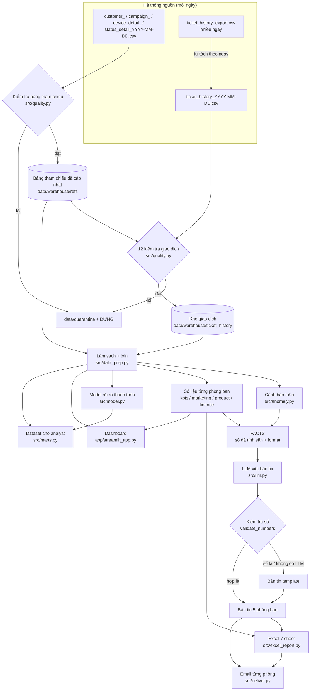

# Luồng dữ liệu & định nghĩa chỉ số

## 1. Sơ đồ

## 2. Từng bước

| Bước | Code | Đầu vào | Đầu ra | Khi nào |
|---|---|---|---|---|
| Tách file xuất nhiều ngày | `ingest.split_exports` | `ticket_history_<tên>.csv` | file theo ngày | Mỗi lần nạp |
| Kiểm tra + cập nhật bảng tham chiếu | `quality.check_reference`, `ingest.run` | `customer_/campaign_/device_detail_/status_detail_<ngày>.csv` | `data/warehouse/refs/*.parquet` | Trước giao dịch cùng ngày |
| Kiểm tra + nạp giao dịch | `quality.check_batch`, `ingest.run` | `ticket_history_<ngày>.csv` | `data/warehouse/ticket_history/<ngày>.parquet` | Mỗi ngày |
| Làm sạch + join | `data_prep.clean_and_join` | kho + bảng tham chiếu | bảng giao dịch đầy đủ (31 cột) | Mỗi lần báo cáo |
| Cảnh báo tuần | `metrics.weekly_error_rates`, `anomaly.detect` | bảng giao dịch | tỷ lệ lỗi theo tuần × nhóm lỗi, cờ cảnh báo | Mỗi lần báo cáo |
| Số liệu phòng ban | `departments.build` | dữ liệu **tới hết tuần** | FACTS + bảng cho từng phòng | Mỗi lần báo cáo |
| Bản tin | `briefs.generate_brief` | FACTS của phòng | bản tin (LLM hoặc template) | Mỗi lần báo cáo |
| Excel, email | `excel_report.build`, `deliver.deliver` | bản tin + bảng | `.xlsx`, email / `.eml` | Mỗi lần báo cáo |
| Dataset analyst | `marts.build` | bảng giao dịch + tham chiếu + model | `data/marts/` | Khi cần / hằng tháng |

**Nguyên tắc không nhìn tương lai:** khi chạy cho tuần W, mọi số liệu (KPI, phân nhóm khách, điểm quay lại, campaign, tài chính) chỉ dùng dữ liệu tới hết tuần W → chạy lại tuần cũ cho đúng kết quả lúc đó.

## 3. Định nghĩa chỉ số

### 3.1 6 nhóm KPI (Ban lãnh đạo, theo tháng) - `src/kpis.py`
Tháng < 500 lượt thanh toán (giai đoạn COVID) bị ẩn. Chỉ số cần cửa sổ tương lai để `n/a` cho tới khi đủ dữ liệu.

| Nhóm | Chỉ số | Cách tính | Chiều tốt |
|---|---|---|---|
| 1. Tăng giao dịch thành công | Vé đặt thành công | Số giao dịch `status_id = 1` | ↑ |
| | Tỷ lệ chuyển đổi (khách) | Khách có ≥1 giao dịch thành công / khách có thanh toán trong tháng *(dữ liệu không có lượt truy cập nên tính ở mức khách)* | ↑ |
| | Doanh thu | Tổng `final_price` giao dịch thành công | ↑ |
| 2. Tăng tỷ lệ quay lại | Khách mới mua lần 2 trong 90 ngày | Khách có lần mua thành công **đầu tiên** trong tháng, mua lần 2 trong 90 ngày | ↑ |
| | Giữ chân sau 30 ngày | Như trên, cửa sổ 30 ngày | ↑ |
| 3. Giảm phụ thuộc khuyến mãi | Mua lại không dùng khuyến mãi | Giao dịch mua lại (không phải lần đầu) không có campaign / tổng giao dịch mua lại | ↑ |
| | Chi phí giảm giá / 1 khách KM quay lại | Tiền giảm giá cho khách mới đến bằng khuyến mãi trong tháng / số khách đó quay lại trong 90 ngày | ↓ |
| 4. Cải thiện thanh toán | Tỷ lệ thanh toán thành công | Giao dịch thành công / tổng lượt thanh toán | ↑ |
| | Tỷ lệ lỗi thanh toán | 1 − tỷ lệ thành công | ↓ |
| 5. Tối ưu mobile | Tỷ lệ chuyển đổi trên mobile | Như tỷ lệ chuyển đổi, chỉ tính giao dịch `platform = mobile` | ↑ |
| | Tỷ lệ hoàn tất thanh toán trên app | Tỷ lệ thành công của giao dịch mobile | ↑ |
| 6. Giá trị khách hàng | Tần suất mua | Vé thành công / khách có mua trong tháng | ↑ |
| | Chi tiêu TB / khách | Doanh thu / khách có mua trong tháng | ↑ |
| | Giá trị tích lũy TB / khách | Doanh thu cộng dồn / số khách đã mua cộng dồn | ↑ |

### 3.2 Thanh toán & cảnh báo - `src/metrics.py`, `src/anomaly.py`, `src/product.py`

| Chỉ số | Cách tính |
|---|---|
| Khách lỗi ngay lần đầu | Lần thanh toán đầu tiên của khách có `status_id ≠ 1` |
| Khách bị mất ở bước thanh toán | Lỗi lần đầu **và** không bao giờ mua thành công |
| Tỷ lệ mua lại sau lỗi (7 ngày) | Giao dịch lỗi có giao dịch thành công của cùng khách trong 7 ngày sau / tổng giao dịch lỗi (bỏ 7 ngày cuối dữ liệu) |
| Tỷ lệ lỗi tuần theo nhóm | Số lỗi nhóm `customer` / `external` / `internal` trong tuần / tổng lượt thanh toán tuần |
| Mức nền, z | Mức nền = trung vị 8 tuần **trước**; z = (tỷ lệ − nền) / (1.4826 × MAD, sàn 0.003) |
| Cảnh báo | z ≥ 3, tuần ≥ 100 lượt thanh toán, chỉ chiều **tăng** |
| Lỗi vượt mức | (tỷ lệ − nền) × lượt thanh toán, không âm |
| Khoanh vùng Product/IT | Với mỗi mã lỗi × nền tảng × phương thức: lỗi / lượt thanh toán của nền tảng × phương thức đó, tuần này vs 8 tuần trước (≥ 30 lượt) |
| Danh sách cứu đơn | Giao dịch lỗi trong tuần mà khách chưa mua lại thành công tới cuối tuần, mỗi khách 1 dòng, kèm tin nhắn theo mã lỗi |

### 3.3 Marketing - `src/marketing.py`

| Chỉ số | Cách tính |
|---|---|
| Nhóm khách (theo slide "Phân nhóm khách hàng & chiến lược giữ chân") | Xét theo thứ tự: **giá trị cao** (≥ 3 lần mua, mua gần nhất ≤ 180 ngày) → **mua một lần (mới)** (1 lần, ≤ 30 ngày) → **lâu chưa quay lại** (> 90 ngày) → **nhạy khuyến mãi** (≥ 50% giao dịch có KM) → **thường xuyên** |
| Điểm quay lại 90 ngày | LightGBM trên recency, frequency, monetary, tỷ lệ KM, tỷ lệ ví, tỷ lệ mobile, số lần lỗi…; train trên 3 mốc mà nhãn 90 ngày đã quan sát đủ **trước** thời điểm chấm điểm. < 200 mẫu dương → xếp theo recency. Backtest: AUC ~0.66 (luật recency 0.61) |
| Hiệu quả campaign | Khách mới (theo lần mua thành công đầu) đến từ mỗi loại / mã campaign, đủ 90 ngày quan sát: tỷ lệ mua lần 2 trong 90 ngày, tỷ lệ chỉ mua 1 lần, tiền giảm giá / 1 khách quay lại |

### 3.4 Tài chính - `src/finance.py`

| Chỉ số | Cách tính |
|---|---|
| Đơn lỗi không được mua lại | Tổng `final_price` của giao dịch lỗi mà khách không mua thành công trong 7 ngày sau |
| Giảm giá cho khách không quay lại | Tổng `discount_value` của giao dịch KM thành công mà khách không mua thêm trong 90 ngày sau |
| Tháng chưa đủ dữ liệu | Ẩn **cả tháng** nếu cuối tháng + cửa sổ (7 / 90 ngày) vượt quá ngày cuối dữ liệu (không lấy nửa tháng) |

Đây là **cận dưới** của thiệt hại: dữ liệu không có chi phí quảng cáo và giá trị vòng đời.

### 3.5 Model rủi ro thanh toán - `src/model.py`
Dự đoán giao dịch lỗi **trước** khi thanh toán, chỉ dùng thông tin có tại thời điểm đó (phương thức, nền tảng, giờ, giá, lịch sử lỗi của khách **trước** giao dịch…). Train 2019-2021, test 2022: AUC 0.77 vs 0.75 của luật 1 biến (phương thức thanh toán). Model xếp hạng tốt nhưng dự đoán cao hơn thực tế ở nhóm rủi ro cao → cần hiệu chỉnh nếu dùng xác suất trực tiếp.

## 4. Dữ liệu cho analyst
Bảng, grain, khóa chính và từng cột: [`data/marts/data_dictionary.md`](../data/marts/data_dictionary.md) (sinh tự động bởi `python -m src.marts`).
